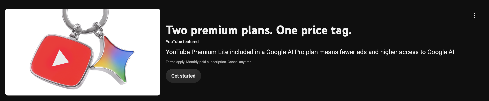
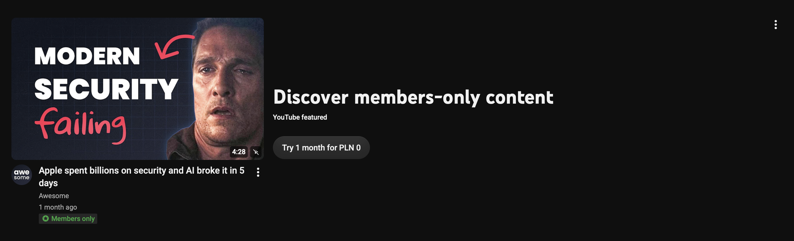

# youtube_remove_featured

UserScript for Tampermonkey or Greasemonkey that removes annoying youtube featured ads

## What it removes

- "YouTube featured" statement banners on the homepage (e.g. YouTube Premium promos)
- "YouTube featured" brand shelves (e.g. the "Listen in the background with YouTube Premium" shelf)

## How it works

YouTube marks promoted content with the `ytBadgeShapePromoted` badge class
("YouTube featured"). The script removes the section containing any such badge,
and as a fallback also removes statement banners whose buttons link to
`youtube.com/premium…`. A `MutationObserver` plus the `yt-navigate-finish` event
keeps the page clean during navigation and infinite scrolling.

## Install

1. Install [Tampermonkey](https://www.tampermonkey.net/) (or Greasemonkey).
2. Get from [greasyfork.org](https://greasyfork.org/en/scripts/591807-youtube-remove-featured-banners)
   
   (or install the file via "Utilities > Import from file").
3. Reload YouTube.

The script auto-updates via `@updateURL` whenever a new GitHub release is made.

## License

[MIT](LICENSE)
